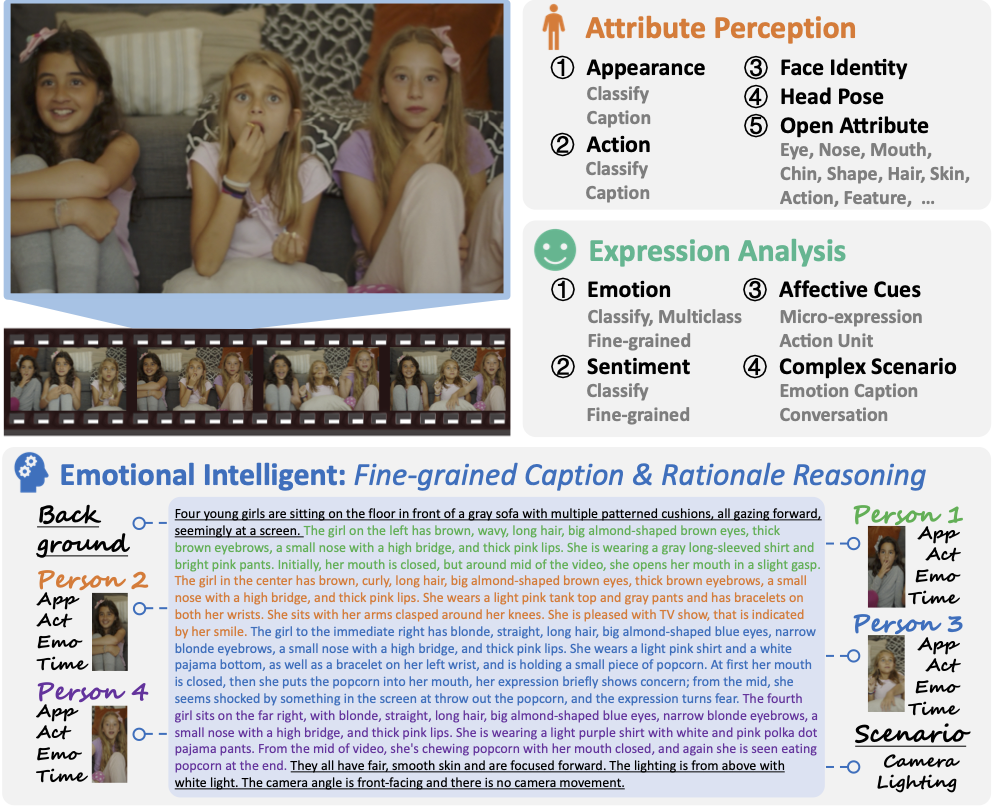
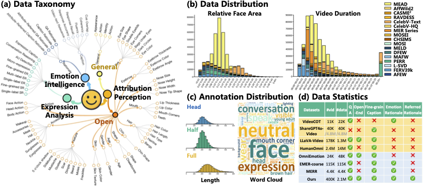

<div align=center>
    
    <h1>VidEmo: Affective-Tree Reasoning for Emotion-Centric Video Foundation Models</h1>

<div class="is-size-5 publication-authors">
<span class="author-block">
    <a href="https://zzcheng.top/" target="_blank">Zhicheng Zhang</a><sup>1,†</sup>,
</span>
<span class="author-block">
    Weicheng Wang<sup>1</sup>,
</span>
<span class="author-block">
    <a href="https://yongjie-zhu.github.io/" target="_blank">Yongjie Zhu</a><sup>3,‡</sup>,
</span>
<span class="author-block">
    Wenyu Qin<sup>3</sup>,
</span>
<span class="author-block">
    <a href="https://scholar.google.com/citations?user=P6MraaYAAAAJ&hl=en/" target="_blank">Pengfei Wan</a><sup>3</sup>,
</span>
<span class="author-block">
    Di Zhang<sup>3</sup>,
</span>
<span class="author-block">
    <a href="https://cv.nankai.edu.cn/" target="_blank">Jufeng Yang</a><sup>1,2,✉</sup>
</span>
</div>

<!-- Institution -->
<div class="is-size-5 publication-authors">
<sup>1</sup><span class="author-block">Nankai University</span>&nbsp;&nbsp;&nbsp;&nbsp;&nbsp;
<sup>2</sup><span class="author-block">Pengcheng Laboratory</span>&nbsp;&nbsp;&nbsp;&nbsp;&nbsp;
<sup>3</sup><span class="author-block">Kuaishou Technology</span>&nbsp;&nbsp;&nbsp;&nbsp;&nbsp;
</div>

<div class="is-size-5 publication-authors">
<sup>†</sup><span class="author-block">Work done at KlingAI</span>&nbsp;&nbsp;&nbsp;&nbsp;&nbsp;
<sup>‡</sup><span class="author-block">Project Leader</span>&nbsp;&nbsp;&nbsp;&nbsp;&nbsp;
<sup>✉</sup><span class="author-block">Corresponding Author</span>&nbsp;&nbsp;&nbsp;&nbsp;&nbsp;
</div>


**🎉 Accepted by [NeurIPS 2025](https://neurips.cc/virtual/2025/loc/san-diego/poster/115267) 🎉**


<a href="https://arxiv.org/abs/2511.02712" target="_blank">
    
</a>
<a href="https://zzcheng.top/VidEmo" target="_blank">
    
</a>
<a href="https://github.com/KwaiVGI/VidEmo" target="_blank">
    
</a>
<a href="https://zzcheng.top/assets/pdf/2025_NeurIPS_VidEmo_poster.pdf" target="_blank">
    
</a>
<br>
<a href="https://huggingface.co/KwaiVGI/VidEmo" target="_blank">
    
</a>
<a href="https://huggingface.co/KwaiVGI/EmoCFG" target="_blank">
    
</a>



</div>

> **TL;DR**: We present an emotion-centric video foundation model trained with fine-grained captions and rationales via affective-tree reasoning guidance, achieving high-level emotional intelligence for video understanding.

## 📈 1. News

- 🔥2025-12-01: Train and Evaluation Code released.
- 🔥2025-12-01: Creating repository.
- 2025-09-18: MODA has been accepted to ICML 2025！

## ⚒️ 2. Environment Setup

```
conda create -n VidEmo python=3.9
conda activate VidEmo
python -m pip install -r requirements.txt
```

## 💾 3. Emo-CFG Datasets

**Overview of dataset**


</div>

In (a), the data taxonomy organizes the dataset into three primary face perception tasks: Emotion Intelligence, Expression Analysis, and Attribution Perception, covering a wide range of facial features and emotional attributes. (b) The data distribution plots show the relative face area and video duration across different datasets, illustrating the diversity and variety of video data present in Emo-CFG. (c) The annotation distribution includes the breakdown of facial views (head, half, full) and video length, accompanied by a word cloud highlighting the most frequently annotated terms, such as “neutral”, “face”, and “expression”. (d) Data statistics compares Emo-CFG with other emotion and video datasets, showing that Emo-CFG provides a richer set of annotations and label types, including fine-grained emotion, rationales, and comprehensive video data, making it a unique and valuable resource for emotion-centric research.

> Application should be done by uploading an EULA from our huggingface webpage.

## 🧊 4. VidEmo Family 

To use the model weights, download them from Hugging Face:
- [VidEmo-3B](https://huggingface.co/KlingTeam/VidEmo)
- [VidEmo-7B](https://huggingface.co/KlingTeam/VidEmo)

## 🔬 5. Training & Inference & Evaluation

### 🔮 5.1: Training

TBD

### 🔮 5.2: Inference

TBD

### 🔮 5.3: Evaluation

TBD

## ⭐ 6. Star History

[](https://star-history.com/#KwaiVGI/VidEmo&Date)

## 📫 7. Contact

If you have any questions, please feel free to contact:

- Zhicheng Zhang: gloryzzc6@sina.com
- Weicheng Wang: 1394828098wwc@gmail.com

## 🏷️ 8. Citation

If you find this project useful, please consider citing:

```bibtex
@inproceedings{zhang2025VidEmo,
  author = {Zhang, Zhicheng and Wang, Weicheng and Zhu, Yongjie and Qin, Wenyu and Wan, Pengfei and Zhang, Di and Yang, Jufeng},
  title = {VidEmo: Affective-Tree Reasoning for Emotion-Centric Video Foundation Models},
  booktitle = {Advances in Neural Information Processing Systems},
  year = {2025},
}
```

## 🥰 9. Acknowledgements

This code largely borrows from [ms-swift](https://github.com/modelscope/ms-swift).